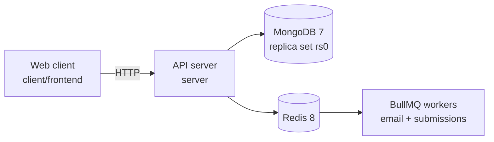

# Paperwork

> Schema-driven form and workflow platform built for modern teams.

Define a form once as a schema, and let the platform render it, validate it, and route submissions through a workflow.

---

## Why?

Internal forms and approval flows — leave requests, onboarding, purchase approvals — are usually hand-coded one at a time: a new UI, new validation, new routing logic, every time. Changing a single field means a code change and a deploy.

Paperwork treats the form as **data**. A schema describes the fields, rules and branching; the platform renders it, validates it, stores responses, and moves respondents through sections based on their answers.

---

## Architecture



**Repository layout**

```
paperwork/
├── client/
│   └── frontend/        # Next.js web client
├── server/              # Express API server
│   ├── docs/            # per-module API notes
│   └── src/
│       ├── config/      # env config, CORS, rate-limit presets
│       ├── middleware/  # requestId, httpLogger, securityAudit, protect, …
│       ├── modules/     # auth, forms, signatures
│       ├── queues/      # BullMQ queue definitions
│       ├── redis/       # cache, form search index, trend engine
│       ├── utils/       # logger, sanitiser, request metadata
│       └── workers/     # email + submission workers
└── docker-compose.yml   # local MongoDB + Redis
```

---

## Features

**Form builder**

- Forms are documents, not code: name, visibility, publish state, response limits and per-form colour theme.
- Nine question types: `TEXT`, `PARAGRAPH`, `DATE`, `TIME`, `CHOICE`, `RADIO`, `DROP_DOWN`, `LINEAR_SCALE`, `RATING`.
- Option, rating and validation config validated with a discriminated union, so an option-based type cannot be given rating config.
- Sections with ordering (`PUT /reorder`) and conditional routing: an answer can trigger `NEXT_SECTION`, `GO_TO_SECTION` or `SUBMIT_FORM`.
- Questions can declare `dependsOn`, so visibility follows earlier answers.
- Bulk endpoints for sections and questions to avoid a request per field.
- Duplicate an existing form, publish and unpublish.

**Validation rules**

`EMAIL`, `URL`, `NUMBER_GREATER_THAN`, `NUMBER_LESS_THAN`, `NUMBER_EQUAL_TO`, `NUMBER_BETWEEN`, `REGEX_MATCH`, `MIN_CHAR_COUNT`, `MAX_CHAR_COUNT`, `DATE_IS_BEFORE`, `DATE_IS_AFTER`, `CHECKBOX_MIN_SELECT`, `CHECKBOX_MAX_SELECT` — each with an optional custom error message.

**Form settings**

`maxResponses`, `maxResponsesPerUser`, `closeDate`, `startDate`, `timeLimitPerResponse`, `collectEmail`, `shuffleQuestions`, `allowEditResponse`, `saveAndContinueLater`, `progressBar`, `customConfirmationMessage`, `redirectUrl`, `allowedDomains`.

**Responses**

- Public fill endpoint, asynchronous submission processing.
- Response listing with sort order, per-question summaries, single-response detail, and CSV export.
- Submission status polling while the worker processes a response.

**Accounts and auth**

- JWT access tokens, with separate secrets and expiries for refresh, reset-password and 2FA-temporary tokens.
- argon2 password hashing (`argon2id` by default, type configurable via `ARGON_TYPE`).
- Email verification, OTP-based 2FA, login alerts and password-change alerts.
- Disposable-email domains blocked at sign-up from a periodically refreshed blocklist (`pnpm run update:disposable`).
- Optional form access restricted to `allowedDomains`.

**Search and caching**

- Server-side form search over a Redis index with an L1 in-process / L2 Redis cache and write-behind invalidation.
- Trend engine using Welford's algorithm to decide which form payloads stay hot in cache (Z ≥ 1.5).

**Observability and security audit** — see below.

---

## Tech Stack

| Component | Technology |
|---|---|
| Client | Next.js 16 (App Router), React 19, TypeScript, Tailwind CSS 4, dnd-kit, Dexie (IndexedDB offline drafts), Sonner |
| API | Node 22, Express 5, TypeScript 6 (strict), Zod 4, Mongoose 9 |
| Auth | `jsonwebtoken`, argon2 |
| Database | MongoDB 7 (single-node replica set `rs0`) |
| Cache / queue | Redis 8 (AOF enabled), BullMQ 5 |
| Logging | winston 3, morgan 1.12, uuid 14 |
| Local infra | Docker Compose |

---

## API

All routes are mounted under `/api/v1`. Full notes per module live in [`server/docs/`](server/docs).

### Auth — `/api/v1/auth`

| Method | Path | Purpose |
|---|---|---|
| POST | `/sign-in` | Email + password login |
| POST | `/sign-in/2fa/:otp` | Complete 2FA challenge |
| POST | `/sign-up` | Register (rejects disposable domains) |
| POST | `/sign-out` | Revoke session |
| GET / POST | `/me` | Read / update profile |
| POST | `/refresh-token` | Exchange refresh token for an access token |
| POST | `/send-verification` | Issue verification OTP |
| POST | `/verify-email` | Confirm email address |
| POST | `/change-password` | Change password |
| POST | `/forgot-password` | Request reset link |
| POST | `/reset-password/:token` | Consume reset token |
| POST | `/check-email` | Registration availability |
| GET | `/account` | List account actions |
| POST | `/account/action` | Execute account action |
| GET / POST / PUT | `/account/personal` | Read / update personal settings |

### Forms — `/api/v1/forms`

| Method | Path | Purpose |
|---|---|---|
| GET | `/` | List forms |
| POST | `/` | Create form |
| GET | `/search` | Search forms |
| GET | `/:formId` | Read form |
| PUT / PATCH | `/:formId` | Replace / update form |
| PUT | `/:formId/bulk` | Bulk update |
| DELETE | `/:formId` | Delete form |
| POST | `/:formId/publish`, `/unpublish`, `/duplicate` | Lifecycle |

### Sections and questions

| Method | Path |
|---|---|
| GET / POST | `/api/v1/forms/:formId/sections` |
| GET / PUT / DELETE | `/api/v1/forms/:formId/sections/:sectionId` |
| PUT | `/api/v1/forms/:formId/sections/reorder` |
| GET / POST | `/api/v1/forms/:formId/sections/:sectionId/questions` |
| GET / PUT / DELETE | `…/questions/:questionId` |
| POST | `…/questions/bulk` |
| PUT | `…/questions/reorder` |

### Filling and responses — `/api/v1/forms/:formId/fill`

| Method | Path | Purpose |
|---|---|---|
| GET | `/` | Render a form for a respondent |
| POST | `/` | Submit a response |
| GET | `/responses` | List responses |
| GET | `/responses/summary` | Per-question summaries |
| GET | `/responses/:responseId` | Response detail |
| GET | `/responses/export/:exportType` | Export responses as CSV |
| GET | `/submissions/:submissionId/status` | Submission processing status |

### Signatures — `/api/v1/cloudinary/signature`

Signed Cloudinary upload parameters.

Errors return a consistent envelope: `{ success: false, message, requestId }`.

---

## Observability and Security Audit

Every request gets a correlation id in `X-Request-ID`, assigned by the first middleware and echoed on the response. Inbound ids are accepted only if they match a strict charset and length; anything else is replaced with a fresh UUIDv4, so a client cannot inject newlines or terminal escapes into an audit trail or forge an id to frame another actor.

The id is held in an `AsyncLocalStorage` scope, so `logger.info()` inside a service, repository, Redis helper or BullMQ worker is tagged with the active request id **without any function receiving or forwarding one**.

**Access logs** — `HTTP_REQUEST_RECEIVED` on arrival (so a request that hangs or crashes is still on record) and `HTTP_REQUEST_COMPLETED` on response, carrying method, absolute path, route pattern, route params, query, sanitised body, status, duration, client IP, forwarded-for, user agent, authenticated user, and whether the client aborted.

Production emits one JSON object per line on stdout; development emits colourised single-line output. Errors go to stderr.

**Security events** — logged at the module that made the decision, so each line carries the real reason rather than a bare status code:

| Event | Level | Raised by |
|---|---|---|
| `SECURITY_UNAUTHENTICATED` | warn | missing / malformed `Authorization` |
| `SECURITY_TOKEN_INVALID` | warn | forged, malformed or unsigned JWT |
| `SECURITY_TOKEN_EXPIRED` | warn | past `exp` or before `nbf` |
| `SECURITY_RATE_LIMIT_EXCEEDED` | warn | any limiter, tagged with preset, window and limit |
| `SECURITY_SUSPICIOUS_PAYLOAD` | warn | one client exceeding the 4xx burst threshold |
| `SECURITY_MALFORMED_PAYLOAD` | warn | body that could not be parsed as expected |
| `SECURITY_DISPOSABLE_EMAIL_BLOCKED` | warn | sign-up against a blacklisted domain |

**Redaction and scrubbing**

- Request bodies are redacted by key (`password`, `confirmPassword`, `token`, `cardNumber`, `secret`, `otp`, …), including compound names such as `refreshTokenExpiresAt`.
- Secrets in the URL path are scrubbed: `/auth/reset-password/:token` and `/auth/sign-in/2fa/:otp` carry live credentials, so the value is replaced while the route pattern is preserved.
- Blocked signups log a masked email and IP; the domain is kept for triage.
- Sanitiser is cycle-safe and depth/breadth/length bounded, so a hostile payload cannot inflate one log line.

**Configuration**

| Variable | Default | Purpose |
|---|---|---|
| `LOG_LEVEL` | `info` (`debug` in dev when `DEBUG=true`) | Minimum winston level |
| `LOG_REQUEST_BODY` | `true` in dev, `false` in production | Log redacted request bodies |
| `LOG_PREFLIGHT` | `false` | Log CORS preflight |
| `LOG_SUSPICIOUS_PAYLOAD_THRESHOLD` | `5` | 4xx burst size that trips an alert |
| `LOG_SUSPICIOUS_PAYLOAD_WINDOW_MS` | `60000` | Burst sliding window |

Body logging is the intersection of the caller asking for it **and** the environment allowing it, so a caller cannot re-enable it in production.

---

## Architecture Decisions

**Why MongoDB instead of PostgreSQL?**
Form definitions and responses are variable-shaped documents — a question carries different config depending on its type, and adding a field type should not require a migration. MongoDB stores a form as one document and answers as another.

**Why run MongoDB as a replica set in development?**
`docker-compose.yml` starts `mongod --replSet rs0` rather than a standalone node. A replica set is a prerequisite for multi-document transactions and change streams, so developing against a standalone node hides failures that only appear once transactions or streams are enabled.

**Why Redis?**
Three distinct jobs: an L2 cache in front of MongoDB for form payloads and the search index, the BullMQ connection for email and submission workers, and the form search index itself.

**Why a monorepo with separate `client` and `server`?**
The two deploy and version independently, have different toolchains and dependency trees, and the API is a contract rather than an implementation detail of the UI.

**Why winston and morgan together?**
Morgan already owns the request lifecycle and handles the `finish`/`close` edge cases correctly; winston owns formatting, levels and transports. Using a morgan *format function* rather than a token string keeps every access line structured instead of collapsing it into one line of Apache-style text.

---

### Scripts

| Location | Command | Purpose |
|---|---|---|
| `server` | `pnpm dev` | API with reload |
| `server` | `pnpm build` / `pnpm start` | Compile and run |
| `server` | `pnpm format` / `format:check` | Prettier |
| `server` | `pnpm seed:demo` | Seed a published demo form |
| `server` | `pnpm update:disposable` | Refresh disposable-email blocklist |
| `client/frontend` | `pnpm dev` / `build` / `lint` | Client |


## Performance

Not yet benchmarked. There are no published numbers.

Built by [Nikhil Katkuri](https://github.com/NikhilKatkuri).